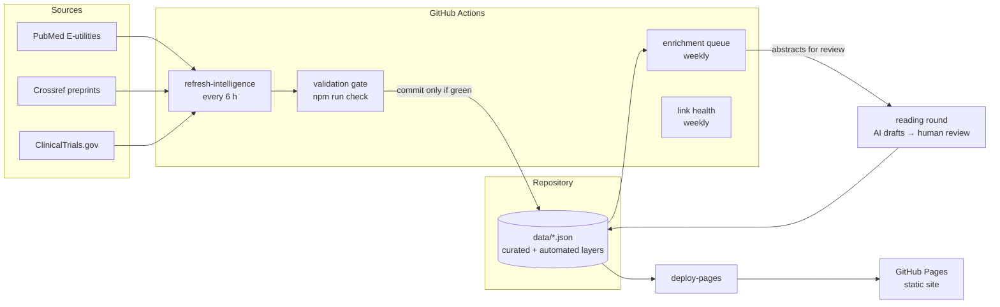

# FerroScope

**A self-updating research-intelligence site for ferroptosis and lipid biochemistry — built so that no claim on the page is stronger than the evidence behind it.**

**Live site:** https://kkailab.github.io/ferroscope/

FerroScope tracks the ferroptosis field in one place: new papers, preprints and trials as they appear, 37 laboratories worldwide, the methods used to detect ferroptosis, the mechanisms that connect them, and the terminology needed to read the literature. Every record states how deeply it has been read and where its evidence stops. The data refreshes itself every six hours, and nothing reaches the site without passing the full validation suite.

## What is on the site

| Section | What it holds |
|---|---|
| **Research signals** | New PubMed papers, preprints and ClinicalTrials.gov records, refreshed every 6 hours, scored for research fit and merged with the curated layer on canonical identity (DOI → PMID → NCT → URL) so that one study renders once. |
| **Paper reading layer** | 28 papers with a 60-second question card, a figure-level causal audit and a statement of what the evidence cannot show. |
| **Laboratories** | 37 laboratories across 11 countries and regions, each with its persistent research question, capability profile and an automated PubMed author watch. |
| **Methods atlas** | 16 detection methods (BODIPY-C11, oxidised-PL LC-MS, MDA/4-HNE, genetic epistasis …) against 13 decision axes, with the controls each needs and what it cannot prove alone. |
| **Mechanism network** | 18 mechanism nodes drawn as a directional reasoning chain (drivers → membrane composition → peroxidation → execution → disease), with every edge anchored to papers in the reading layer. |
| **Terminology** | 36 terms switchable between English, 中文 and 日本語, sorted by how often the read papers use them, and linked in both directions to the mechanism network. |
| **External research hub** | 15 curated databases, protocol collections and tools, with authority labels and use boundaries. |

## Architecture



- **Front end:** a static site of plain ES modules (`index.html`, `app.js`, `lib/*.mjs`) with no framework or build step. The same `lib/` modules run in the browser, in the ingestion pipeline and in the validators, so the three cannot disagree about what a record means.
- **Data:** 25 JSON datasets under `data/`. Each is registered in a manifest (`data/schema-versions.json`) with a schema version, shape, accountable owner and review state.
- **Automation:** five GitHub Actions workflows handle the data refresh, deployment, verification of every push and pull request, laboratory link health and the curated-enrichment queue. [`docs/AUTOMATION.md`](docs/AUTOMATION.md) describes each loop and what it deliberately leaves to a person.

## Engineering highlights

- **The evidence contract is enforced, not described.** An automated record can never carry an evidence grade; only a curated audit can assign one. A method field is `source-checked` only if it resolves to a registered source, a review event and a scope that was actually read. AI-written drafts are labelled as unreviewed until a named person signs them off. Validators reject each violation. See [`docs/HONESTY-CONTRACTS.md`](docs/HONESTY-CONTRACTS.md).
- **Mutation-tested validators.** The coherence, manifest, registry, graph and refresh-resilience checks are each paired with a suite that breaks a temp-directory copy of the corpus in a specific way and asserts that the break is rejected. A validator that has stopped working turns the suite red.
- **A refresh that degrades honestly instead of freezing.** A failing source keeps its last records, marked stale with the error class and last success. After 14 days it publishes its failure rather than old data, and the other sources keep updating. Undated or impossible-dated records are dropped at ingestion, so one bad upstream record cannot block the rest.
- **A provenance graph derived at load time.** The graph links mechanisms to the individual figure-level claims that support, replicate, contradict or cannot separate them, and each edge carries its review state.
- **Rendered-DOM gates.** `scripts/test-public-surface.mjs` drives the real `app.js` through a small DOM harness. It fails if hostile source metadata survives escaping, if an automated record renders as graded or peer-reviewed, or if Chinese or Japanese text leaks outside the terminology section. A separate check renders one calendar date under three timezones and asserts it reads the same.
- **Self-maintaining monitoring.** Each laboratory's author watch records its own run state and one-year match count, and the site shows them. Watches that return zero matches are surfaced so the query can be corrected.

## Current status

- **Provenance graph.** The graph holds 264 nodes and 300 edges. By review state: recorded-unverified 77, archive-derived 157, source-checked 66 and independently-rechecked 0.
- **Source registry.** `data/source-reviews.json` holds 79 canonical source records and 47 review events, of which 0 independent. Graph coverage is reported by surface type (metadata record, abstract text, figure caption, methods text …) and access extent, not by a single depth number.
- **Method layer.** 33 of 208 method decision fields are source-checked, and 175 remain pending, each naming what has to be read to resolve it.
- **Review and sealing.** 0 datasets are sealed, and no scope has yet been independently rechecked. That second reading has to come from a reviewer other than the implementer.
- **Reading boundaries.** Two papers were read as accepted author manuscripts rather than versions of record: Kagan et al. 2017 as PMC5506843 and Zou et al. 2020 as PMC7353921. Their figure captions were read; the rendered figure panels and supplements were not opened.
- **Still pending.** Authorised HTTPS browser and accessibility QA has not been done. Link health measures reachability, not whether a page's content is still correct.

These numbers are derived from the data and enforced by `npm run check:readme`, so this section cannot silently drift from the release. The history of each release is in [`docs/CHANGELOG.md`](docs/CHANGELOG.md).

## Run locally

Node.js 18 or newer is required, and there are no dependencies to install.

```bash
npm start          # serves the site at http://127.0.0.1:4173
npm run check      # the full validation suite
npm run update     # live fetch from PubMed, Crossref and ClinicalTrials.gov (needs network)
```

Serve the site rather than opening `index.html` directly, because browsers block local JSON requests.

<details>
<summary>Individual checks</summary>

```bash
npm run check:data       # automated-record gate, laboratory and monitoring coverage, source status
npm run check:v09        # foreign keys, schema manifest, ownership, review fingerprints, translations
npm run check:papers     # paper layer, correction notices and laboratory attribution
npm run check:graph      # provenance graph contract
npm run check:graph-contract      # negative cases for the graph contract
npm run check:coherence  # cross-file agreement between paper, attribution, registry and mechanism layers
npm run check:coherence-mutations # every coherence rule rejects the break it guards against
npm run check:registry   # regression tests for closed provenance forgeries
npm run check:method-review # method decision-field review contract
npm run test:research    # three-scale research-method build and boundary checks
npm run check:surface    # rendered-DOM language, escaping, evidence and merge gates
npm run check:dates      # one calendar date renders identically in three timezones
npm run check:ingestion  # offline ingestion fixtures under three timezones
npm run check:resilience # which refresh states are publishable and which must fail
npm run check:manifest   # manifest mutation tests
npm run check:readme     # this README's status numbers match the data
npm run check:links      # laboratory sites, resources and method sources (needs network)
```

</details>

### Record a review

```bash
npm run seal -- --reviewer=<owner-id> [files...]
```

Sealing records that a named party other than the owner read those exact bytes. It writes the reviewer, the date and a sha256 of each file, and any later edit fails `check:v09` until the file is reviewed again.

## Evidence model

No single assay defines ferroptosis. FerroScope organises evidence around four linked questions:

1. Is there time-resolved cell death rather than only growth inhibition?
2. Does the phenotype depend on iron and lipid-radical chemistry?
3. Do genetics, target engagement and direct chemical measurements support the proposed mechanism?
4. Does the conclusion survive a physiological model without overstating clinical translation?

BODIPY 581/591 C11, MDA, 4-HNE, GPX4 protein abundance, mitochondrial morphology or a single Ferrostatin-1 rescue can support a study, but none of them is a standalone diagnosis.

Papers are read at three scales:

1. **60-second question card:** the question, the advance, the evidence anchor, the scope and the next decision.
2. **Figure-level causal audit:** intervention, readout, rescue, physiological model and missing link.
3. **Longitudinal lab synthesis:** the persistent question, capability evolution, attribution, contradictions and the next point to watch.

Reading depth belongs to a unique paper, identified by normalised DOI. A laboratory's contribution is a separate relationship record, so a shared paper is never counted twice and a methods collaborator is never presented as the discovering laboratory.

## Data layers

| File | Holds |
|---|---|
| `data/live.json` | Automated alerts, each stating its source and document class and that its evidence is unassessed. |
| `data/papers-en.json` | Canonical paper records keyed by DOI: the 60-second card, the figure chain, version events, and reading and verification depth. |
| `data/paper-claims.json` | Typed claims read out of the figure chains; the seed for the provenance graph. |
| `data/source-reviews.json` | The canonical source registry and its review events. |
| `data/lab-paper-links.json` | Laboratory contribution records, kept separate from paper facts. |
| `data/labs.json`, `data/labs-en.json` | Laboratory links, categories, public identity, focus and multilingual search aliases. |
| `data/methods.json`, `data/evidence-bundles.json` | The methods atlas with its 13 decision axes, and question-to-minimum-evidence decision paths. |
| `data/knowledge-network.json` | Mechanism nodes, typed evidence-anchored edges and method links. |
| `data/glossary.json` | Trilingual terminology, with review status for each translation. |
| `data/ai-reading-drafts.json` | Abstract-level AI drafts awaiting human review. |
| `data/record-overlays.json`, `data/signal-briefs-en.json` | Curated document-class and evidence-grade decisions, and English briefs for signals. |
| `data/watch-queries.json`, `data/monitoring-coverage.json` | Per-laboratory PubMed author watches and their run state. |
| `data/resources.json` | External research resources with authority and caution labels. |
| `data/schema-versions.json` | The manifest that registers every dataset. |
| `data/lab-research.json` | Legacy audit archive, kept for provenance and not rendered publicly. |

## Repository layout

```
index.html, app.js, styles.css, v09.css   the site
lib/                                      record semantics, provenance graph, source registry (shared by site, pipeline and validators)
scripts/                                  ingestion, validators, mutation suites, build tools
data/                                     all datasets
docs/                                     automation, honesty contracts, recipes, enrichment queue, changelog
docs/history/                             review-round reports and delivery audits from development
.github/workflows/                        refresh, deploy, verify, link health, enrichment queue
```

## Limitations

- Automated capture is a navigation layer, not a literature conclusion, and an author-name match is not laboratory attribution.
- Pathway maps and databases are secondary navigators, and organelle localisation depends on conditions.
- Disease signatures and ex situ human organs are not clinical proof.
- A laboratory URL that returns 200 proves only that the URL resolves, not that the page still describes that laboratory.
- Corrections, Editor's Notes and retractions stay attached to the publication record.

## Development process

The project was developed in review rounds. In each round an independent review looked for places where the site claimed more than its evidence supported; the next round fixed them and added a regression test for each fix. AI coding tools were used for implementation and review, and the reports from each round are archived in [`docs/history/`](docs/history/).
